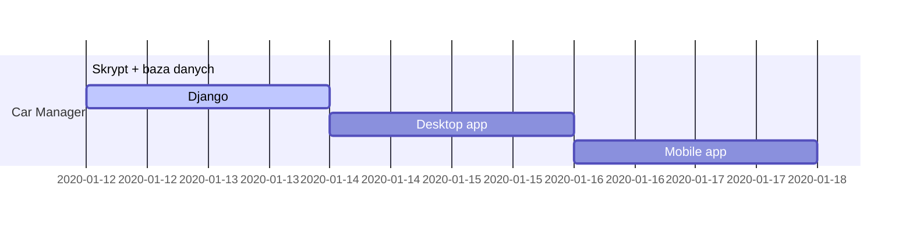
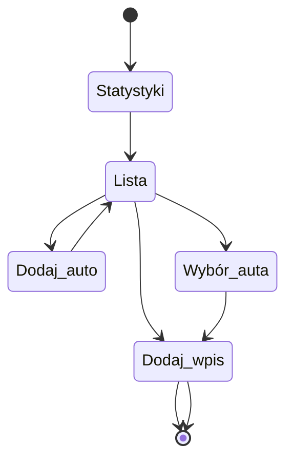

### Wprowadzenie

Kiedyś używałem aplikacji do kontrolowania budżetu związanej z użytkowaniem auta. Bardzo praktyczne aplikacje pozwalały mi na zapisywanie przebytych tras i tankowań, dzięki czemu wiedziałem jakie koszty ponoszę miesięcznie. 

Niestety, aplikacje których używałem posiadają również wady. 
Gdy przez ok rok nie używałem aplikacji i do niej powróciłem, po wprowadzeniu danych odnośnie tankowania, wskazywało błędne dane w postaci 10 000 km do następnego tankowania, etc.

Postanowiłem stworzyć własną aplikację tego typu dla własnego użytku. 
Wpierw będzie to skrypt obsługujący bazę danych, następnie aplikacja desktopowa, która będzie korzystać z danych z Django rest framework, a na koniec aplikacja mobilna.

Mógłbym od razu przejść do tworzenia API, by cały proces tworzenia bazy danych przeszedł niemalże automatycznie, lecz dla ćwiczeń to idealne rozwiązanie.

Repozytorium projektu: [Car Manager](https://github.com/RL89pl/car-manager)

### Diagram


```msc
Klient->Program: Uruchomienie
Program->Klient: Statystyki
Program->Klient: Lista wyboru
Klient -->Program: Wybór auta
Klient -->Program: Dodanie wpisu
Klient -->Program: Dodanie auta
Note right of Program: Zgodnie z wybraną opcją
Program->Klient: Output
```


---